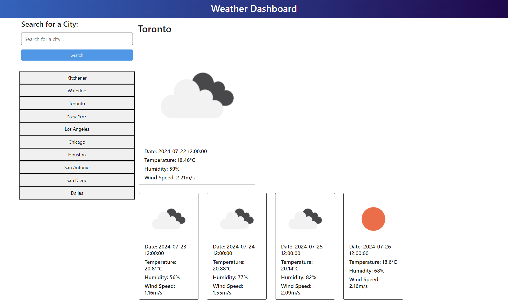

# open-weather-dashboard

## Description

A weather dashboard that will use OpenWeatherMap API to retrieve weather data for cities.

## Installation

N/A

## Usage

A page where user can input name of a city.
The page will display up to 5 days of the given city weather.

## Credits

OpenWeatherMap API

## Features

None

## Tests

Run the website online and check if there's any spelling errors or bugs\
Page link: https://eliotcho.github.io/open-weather-dashboard/

## Screenshots

The following image shows the web application's appearance and functionality:
Main page

When search history goes over 10 searches
